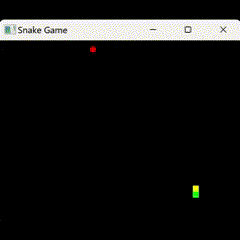
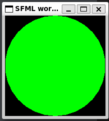

---

# 🐍 Snake Game 🐍

A Classic 2D Snake Game Written in C++ Using SFML by Team Charlie

---



---

## Instructions

- When prompted to play select `y` (Yes) or `n` (No)

- Move your snake with the arrow keys on the keyboard

- The snake has a green body with a yellow head

- Eat the red fruit to grow your snake!

- **Avoid walls and touching your own snake body!**

- **Enjoy and have fun!** 😎

---

## SFL Game Development

SFML (Simple Fast Multimedia Library) is used to display graphics. It is a simple to use library that provides a simple interface to the various components of your PC, to ease the development of games and multimedia applications.

- **[how to install the library from their website](https://www.sfml-dev.org/tutorials/2.5/)** 

- [Download SFML](https://www.sfml-dev.org/download/sfml/2.6.0/)

- [SFML Documentation](https://www.sfml-dev.org/documentation/2.6.0/)

### Example

Here is the sample program that SFML provides in their tutorials to test if everything is working. You should see a green circle if it works.

```c++
#include <SFML/Graphics.hpp>

int main()
{
    sf::RenderWindow window(sf::VideoMode(200, 200), "SFML works!");
    sf::CircleShape shape(100.f);
    shape.setFillColor(sf::Color::Green);

    while (window.isOpen())
    {
        sf::Event event;
        while (window.pollEvent(event))
        {
            if (event.type == sf::Event::Closed)
                window.close();
        }

        window.clear();
        window.draw(shape);
        window.display();
    }

    return 0;
}
```



### WSL/Linux

If you develop C++ on WSL/Linux you may want to create a makefile to help build your project more easily.

```makefile
build: snake.cpp
	g++ -c snake.cpp
	g++ snake.o -o snake-game -lsfml-graphics -lsfml-window -lsfml-system
```

Also if you use WSL, ensure you've [updated to WSL 2](https://learn.microsoft.com/en-us/windows/wsl/install#upgrade-version-from-wsl-1-to-wsl-2), install [VcXsrv and X11](https://sourceforge.net/projects/vcxsrv/),
and set these environment variables in linux:

```bash
$ export DISPLAY=:0
$ export LIBGL_ALWAYS_INDIRECT=0
```

## Debugging

1. Error free compilation and basic window display without error✅
2. Snake moves clearly in one direction and length stays constant until food is consumed✅
3. Snake responds intuitively to arrow keys or WASD✅
4. Food and snake are clearly indicated by color/design choices✅
5. Food is placed randomly at the beginning of the game and after each time it is eaten✅
6. Each food eaten grows the snake uniformly✅
7. Snake eating itself ends/restarts the game✅
8. Snake eating wall ends/restarts the game✅
9. The game is reasonably difficult showing consideration of game scale and FPS✅
10. Overall playability and resemblance of snake✅
11. Demonstrates OOP concepts by utilizing classes for Snake and Food✅
12. Code is organized clearly and logically, with meaningful variable names and uniform style✅
13. Code is documented with clear and meaningful comments✅
